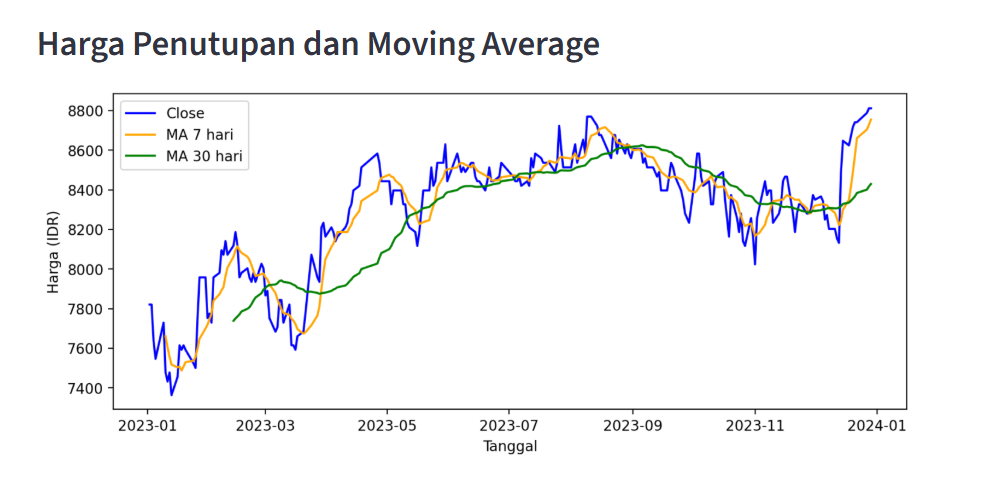
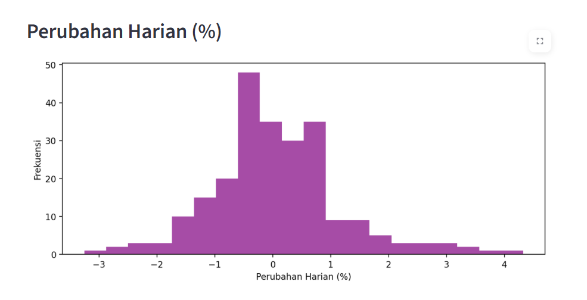

# 📊 BBCA Stock Analyzer

Aplikasi interaktif untuk menganalisis saham **Bank Central Asia (BBCA)** dengan visualisasi harga, moving average, histogram perubahan harian, dan insight otomatis. Dibuat dengan Python & Streamlit untuk portofolio Data Sains.

---

## Fitur
- Pilih rentang tanggal sendiri  
- Visualisasi harga **Close**, **Moving Average 7 & 30 hari**  
- Histogram perubahan harian (%)  
- Insight otomatis: harga tertinggi/rendah, rata-rata, perubahan harian  
- Tampilan interaktif dan mudah digunakan  
- Cocok untuk analisis data & portofolio mahasiswa Data Sains  

---

## Screenshot
  
  

> Pastikan file screenshot (`price_moving_average.png` & `daily_change.png`) berada di folder project yang sama dengan README.md  

---

## Cara Install & Jalankan
1. Clone repository:
```bash
git clone https://github.com/ainulriski/analisis-saham-bca.git
